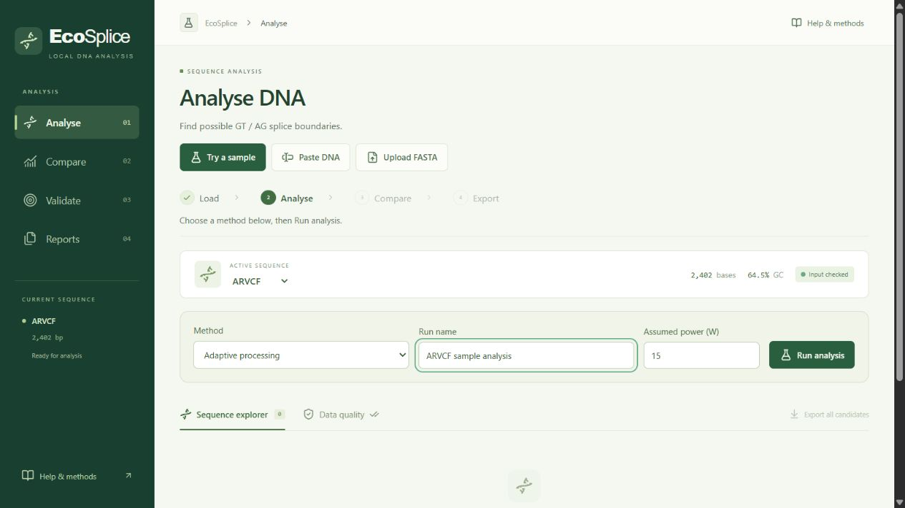
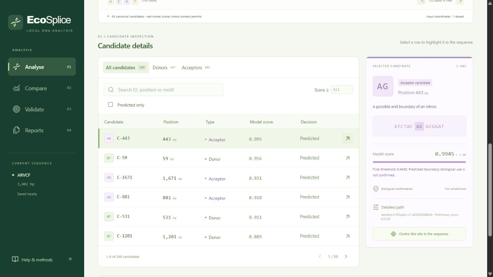

# EcoSplice

A complete local DNA splice-site analysis dashboard built with **React, Python/FastAPI and SQLite**. It predicts possible canonical GT donor / AG acceptor boundaries, compares three implemented methods using actual measurements, and exports saved results.

**All five parts are implemented.** The green interface uses real saved models, local measurements and SQLite history. No public deployment.

## Sample analysis

Load the real ARVCF sample (2,402 bases), choose a method, and click **Run analysis**.



The completed run lists 349 GT/AG candidates. Select a row to inspect its position, model score, DNA context, and processing route.



## Start locally

Setup is already prepared on this laptop. Double-click **start-ecosplice.cmd**, or run:

```powershell
.\start-ecosplice.cmd
```

Open [EcoSplice](http://127.0.0.1:8765). Keep the terminal open; Ctrl+C stops the service. One Python process serves the built React interface and API. Normal use is offline and does not retrain.

For a fresh checkout, install Python 3.12 and Node.js 20.19+ or 22.12+, then run `setup-ecosplice.cmd` once. The prebuilt release ZIP requires Python 3.12 only. Setup pins dependencies and prepares local caches. [Setup and packaging details](docs/LOCAL_RELEASE.md).

Follow **Load → Analyse → Compare → Export** inside the app. Use [EcoSplice_test.fasta](data/demo/EcoSplice_test.fasta) for an upload test: real ARVCF DNA, 2,402 bases. The input dialog and Help page can download the same DNA. [Manual testing checklist](docs/MANUAL_TESTING.md).

For development, run `python scripts/start_backend.py` and `npm run dev` separately, then open port 5188. Stop that backend before launching production on 8765. Optional configuration is in `config.example.ps1`; use `--port 8766` if a port is occupied.

## Use the dashboard

1. **Analyse:** choose one of four real annotated samples, paste DNA, or upload a single FASTA/TXT record. Review input, choose a method/run name/assumed watts, and press Run analysis. Inspect linked map, DNA context, candidate table and actual processing route/scorer.
2. **Compare:** measure the active saved input with 3, 5 or 7 repetitions per method. See medians, min–max, IQR, stage times, work avoided, prediction differences, quality where labels exist, and estimated energy. A separate saved experiment compares multiple lengths/motif densities and explicitly identifies synthetic stress DNA.
3. **Validate:** explore the actual held-out donor/acceptor metrics, confusion matrices, class counts, frozen thresholds, descriptive threshold curves and adaptive trade-offs. Uploaded DNA receives no invented accuracy.
4. **Reports:** reopen, rename or delete completed local runs. Export all candidates or the current explorer filters as CSV, JSON or printable HTML. Use the browser's Print → Save as PDF for the latter.
5. **Help & methods:** input/direction/coordinate rules, biology, implemented algorithms, data provenance and limits. Data quality remains a tab under Analyse.

Empty/loading/error states are explicit. Failed analysis clears results and never substitutes examples. Loading different DNA invalidates pending responses. Stop waiting ignores the pending response; work already started may still finish and save on the server.

## Scientific scope

Input permits A/C/G/T/N, at least **20 called bases**, at most **100,000 bases**, one FASTA record with its header first, and files no larger than 1 MB. DNA is analysed in its supplied orientation; no automatic reverse-complement analysis. Minus-strand bundled demos are already oriented.

Positions are **one-based starts of GT/AG motifs within the input**. Scores require 50 bases before + the two-base motif + 50 bases after, containing only A/C/G/T. Edge/N contexts remain visible with unavailable scores and reasons. Outputs identify possible boundaries; they do not pair introns or choose DNA sections to remove.

Saved model `ecosplice-v1-64223ad070d6` was trained on a frozen GENCODE v49 / GRCh38 chr22 subset. Overlapping gene groups and duplicate contexts are isolated across train/validation/test. Detailed canonical-candidate test F1 is **0.7987 donor / 0.7173 acceptor**. Adaptive F1 is **0.7858 / 0.7238**, avoiding **80.77%** of detailed evaluations. Adaptive donor test loss exceeds its validation selection tolerance and is disclosed. These are sampled, one-chromosome results. Scores are model scores, not calibrated biological probabilities; absent annotations do not establish inactivity.

Exhaustive evaluates every eligible position. Filtering evaluates eligible GT/AG candidates using the same detailed model; their canonical outputs agree. Adaptive uses a cheaper scorer and calls the detailed model only for uncertain cases. With fixed model/context, all three are **O(n)**; the optimization reduces expensive evaluations. Benchmarks show actual findings, including negative reductions if a method is slower.

**Estimated energy (J) = assumed power (W) × measured computation time (ms) / 1000.** Assumptions are visible and saved. Timings exclude startup, warm-up, HTTP/UI transfer, serialization and SQLite writes. These are computation measurements and constant-power energy estimates, not laptop power measurements.

## Data handling and project layout

Completed runs retain normalized DNA, predictions, model/settings, original timing, explicit power assumptions and provenance in `data/local/runs.sqlite3`. History survives browser/service restart. Comparisons attach to a run without rewriting its original predictions/timing. Downloaded files remain separate from deleted history. No remote service receives DNA.

| Location | Contents |
| --- | --- |
| `frontend/` | Green React interface, focused page/API modules and JavaScript tests |
| `backend/` | Sequence/model/algorithms/comparison, FastAPI, SQLite/report modules and tests |
| `scripts/data/`, `scripts/models/` | Reproducible development-time data preparation/training/verification |
| `models/`, `results/` | Bundled saved coefficients, genuine evaluation and measured reference experiments |
| `data/demo/`, `data/processed/` | Real FASTA demos, frozen labels/manifests and verification |
| `data/raw/`, `data/local/` | Ignored source cache and local history |
| `docs/` | Scientific methods, API/UI contracts and implementation plan |
| `qa/` | Ignored screenshots, experiments and isolated verification databases |

## Verify or reproduce

```powershell
python -m pip install -r backend/requirements-dev.txt
npm test
npm run test:backend
npm run build
npm run preview
```

Forty-five Python tests and twelve JavaScript tests pass. Browser verification covers real sample/FASTA predictions, labelled versus unknown truth, measured comparisons, restart/reopen/rename, matching CSV/JSON/HTML exports, input/service failures, long inputs and phone layout. The 100,000-base browser flow returned 50,000 candidates with batch size bounded at 512. Evidence and limitations are in [DASHBOARD_INTEGRATION.md](docs/DASHBOARD_INTEGRATION.md).

The offline CLI remains available:

```powershell
python scripts/analyze_sequence.py --input data/demo/REAL-003.fasta --method adaptive --output results/my-analysis.json
```

Development-only reproduction (not needed for the demonstration):

```powershell
python scripts/data/download_reference.py
python scripts/data/prepare_dataset.py
python -m pip install -r scripts/models/requirements.txt
python scripts/models/train_models.py
python scripts/models/verify_algorithms.py
```

The first download needs internet; preparation uses its cached sources. Full scientific details: [dataset/coordinates](docs/DATASET_AND_COORDINATES.md), [models/algorithms](docs/MODELS_AND_ALGORITHMS.md), [local service](docs/LOCAL_SERVICE.md). Read [PROJECT_HANDOVER.md](PROJECT_HANDOVER.md) and [IMPLEMENTATION_PLAN.md](docs/IMPLEMENTATION_PLAN.md) for project context and scientific acceptance criteria.

## Release and submission

- `releases/EcoSplice-1.0.0.zip`: built app, saved model, demos, pinned setup and submission materials; excludes user history, raw references and development caches.
- [Final report](docs/submission/EcoSplice_Report.pdf), [editable report source](docs/submission/REPORT_SOURCE.md), [13-slide presentation](docs/submission/EcoSplice_Presentation.pptx).
- [Architecture](docs/submission/ARCHITECTURE.md), [demonstration script](docs/submission/DEMO_SCRIPT.md), [viva notes](docs/submission/VIVA_NOTES.md).
- Source build and 49 Python / 14 JavaScript tests pass. Fresh extracted-package verification exercises actual loopback HTTP, restart/history/export, the 100,000-base limit and offline runtime with outbound connections blocked. Evidence stays under ignored `qa/experiments/local-release/`.
- React styling is consolidated in `frontend/src/app.css`; detailed explanations are expandable. Scientific datasets, coefficients and recorded experiments remain unchanged.
