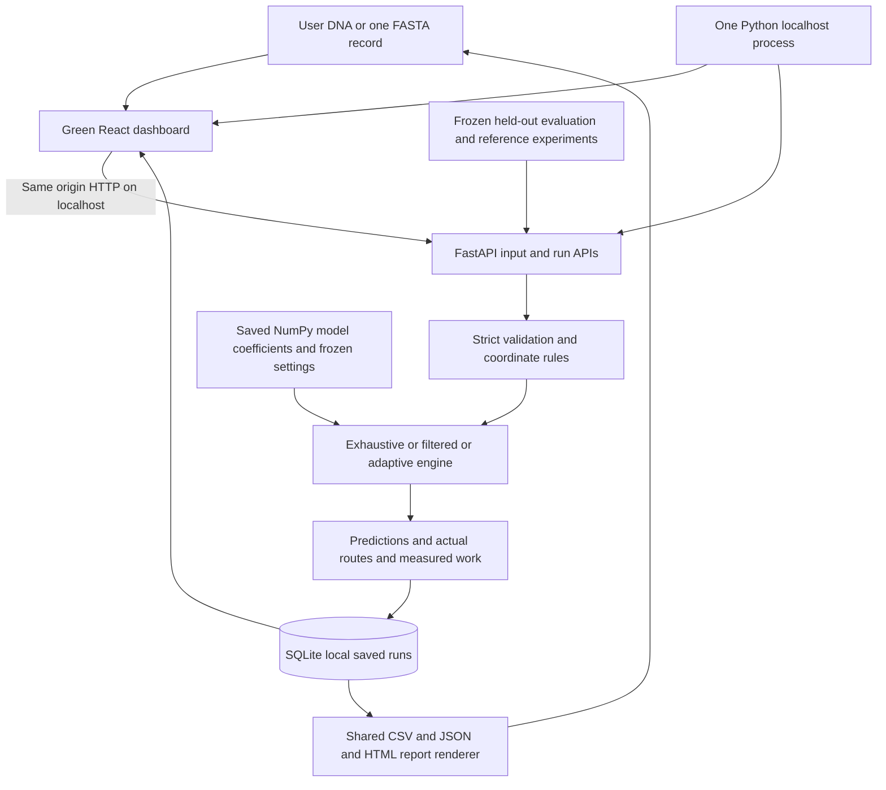

# EcoSplice architecture

The production launcher serves built React files and the API on the same loopback port. React handles presentation and request state. Python validates DNA, loads the saved coefficients once at service startup, runs inference and measures the computation. SQLite preserves scientific snapshots; repeated comparisons attach to the selected snapshot. Reports read that stored record using one shared selection contract.

Data preparation and scikit-learn training happen separately during development. They generate the saved numeric coefficients, manifests, labelled demonstrations and evaluation JSON. Application startup has no training, source downloads or remote inference dependency. The diagram's model/evaluation files are immutable scientific artifacts; the local database is writable user history.
