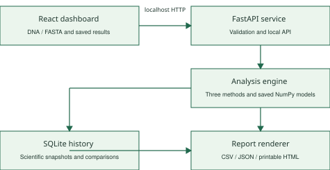
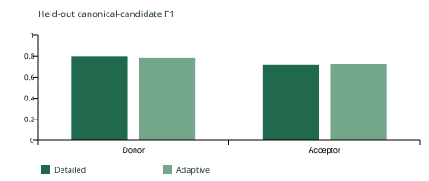
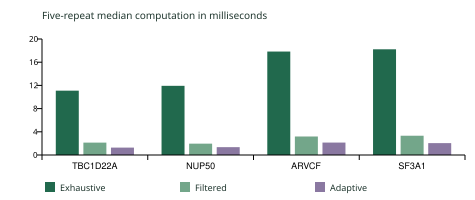

# EcoSplice final project report

Local DNA splice boundary prediction and measured algorithm comparison. Release 1.0.0. Prepared 9 October 2026.

### Abstract and implemented scope

EcoSplice is a local React, Python and SQLite application that predicts possible canonical GT donor and AG acceptor boundaries from DNA context. A reproducible chromosome 22 dataset supplies annotated sites and ordinary occurrences. Saved logistic models provide genuine predictions. Three operational methods compare exhaustive scoring, candidate filtering and cheaper preliminary scoring with detailed escalation. The application measures computation and work counts, preserves completed runs and exports consistent reports.

Detailed held-out canonical-candidate F1 is 0.7987 for donors and 0.7173 for acceptors. Adaptive F1 is 0.7858 and 0.7238 while avoiding 80.77 percent of detailed evaluations. Both the saving and the donor quality loss are reported. Outputs identify possible boundaries; complete intron pairing, sequence removal and tissue-specific decisions require additional work.

### Local application architecture



One loopback Python process serves the built React interface and FastAPI endpoints. Python owns authoritative input checks, saved model inference and timing. SQLite stores original sequence, scientific settings, predictions and attached comparisons. A shared report renderer selects all or filtered candidates from the saved snapshot. Separate development scripts prepare data and train; ordinary startup never calls them.

## Dataset and model preparation

The frozen annotation is GENCODE human release 49 for GRCh38.p14. The sequence is UCSC hg38 primary chromosome 22, corresponding to NC_000022.11. Only the primary chromosome is used; alternate contigs and patches are excluded. Source URLs, checksums and terms remain in the dataset documentation and manifest. Small real samples ship with attribution [1-3].

| Partition | Donor | Acceptor | Non site | Total |
| --- | --- | --- | --- | --- |
| Train | 3654 | 3811 | 85766 | 93231 |
| Validation | 858 | 821 | 18474 | 20153 |
| Test | 900 | 918 | 19401 | 21219 |

The preparation selects 400 protein-coding genes in 304 connected genomic groups and retains 134,603 unique 102-base windows. Positives come from annotated exon adjacency. GT/AG and ordinary negative positions avoid every same-strand boundary in the comprehensive annotation, including annotations outside selected training genes. A negative means unannotated in this release, not experimentally proven inactive.

### Leakage controls and coordinates

Gene spans expanded by 50 bases form connected components when they overlap. Entire components stay within one seeded train, validation or test partition. Global duplicate removal includes reverse-complement equivalents. Audits check overlapping cross-split windows, duplicates and positive motif alignment. Distant gene-family homology independence has not been established.

GTF one-based inclusive exon coordinates become zero-based half-open intervals during preparation. Minus-strand DNA is reverse-complemented into the annotated direction. The application displays one-based motif starts in the supplied sequence: GT at 101 occupies 101-102, with the donor boundary before 101; AG at 199 occupies 199-200, with the acceptor boundary after 200. User DNA remains in its supplied direction.

### Saved classifiers and fixed settings

| Scorer | Context | Features | Donor threshold | Acceptor threshold |
| --- | --- | --- | --- | --- |
| Preliminary | 22 bases | Single bases | 0.36 | 0.31 |
| Detailed | 102 bases | Bases and adjacent pairs | 0.41 | 0.44 |

Training fits three-class logistic regression on train only. Validation chooses scorer thresholds and adaptive routing. The preliminary decisive ranges are donor score at most 0.18 or at least 0.52, and acceptor score at most 0.0775 or at least 0.655. Remaining candidates reach the detailed scorer. Numeric NumPy coefficient archives and a manifest ship with model ecosplice-v1-64223ad070d6. Independent retraining produced byte-identical weights and manifest.

Softmax scores reflect the sampled training class balance. No fitted calibration transform establishes biological probability. The interface therefore calls them model scores. Complete A/C/G/T contexts are required; unknown or cropped contexts receive no invented padding or score.

## Algorithms and complexity

All methods validate the same input, retain the same canonical candidate domain and stream inference in batches of at most 512 windows by default. Incomplete or N-containing windows remain visible with a reason and no score. Ordinary eligible positions really receive detailed scoring in the exhaustive baseline.

### Exhaustive baseline

```text
scan canonical motifs for the shared output list
for each possible two-base start in DNA:
    extract a complete ACGT context when eligible
    send eligible contexts in bounded batches to detailed
    retain scores only for GT donor or AG acceptor
apply each candidate type's detailed threshold
```

### Candidate filtering

```text
scan DNA once for GT and AG
for each canonical motif:
    extract its eligible complete ACGT context
    score bounded batches using the SAME detailed model
    apply the SAME detailed threshold
retain unscoreable motifs with their reason
```

### Adaptive processing

```text
scan DNA once for GT and AG
for each eligible candidate batch:
    score the central 22 bases with preliminary
    finalize decisive low or high preliminary cases
    send only uncertain cases to detailed
    use the final scorer's threshold and record route
retain unscoreable motifs with their reason
```

### Work and space

Let n be length, k canonical motifs, e all eligible contexts, q eligible canonical contexts, m uncertain candidates, w detailed width, l preliminary width, B batch size and c classes. Context extraction/checking and coefficient summation contribute width-dependent work.

| Method | Detailed calls | Preliminary calls | Variable width work |
| --- | --- | --- | --- |
| Exhaustive | e | 0 | O(nw + ecw) |
| Filtered | q | 0 | O(n + kw + qcw) |
| Adaptive | m | q | O(n + kw + qcl + mcw) |

Fixed widths, models and classes make every method O(n) in the worst case. Filtering improves the amount of expensive work rather than the asymptotic class. Additional working/output memory is O(k + Bcw), plus fixed coefficients; storing the input adds O(n). Peak batch windows is a work counter, not measured RAM. Baseline and filtered canonical scores agree within 1e-12 in real-region and maximum-length checks.

## Held out evaluation and adaptive tradeoffs

Evaluation uses frozen test groups after validation selects settings. Per-type canonical-candidate metrics evaluate only that motif domain; ordinary non-motif positions do not inflate splice detection metrics. The donor domain contains 7,497 candidates with 900 annotated donors. The acceptor domain contains 7,523 with 918 annotated acceptors. These supports are separate from all 21,219 sampled test windows.

| Method | Type | Precision | Recall | F1 |
| --- | --- | --- | --- | --- |
| Preliminary | Donor | 0.7350 | 0.7644 | 0.7495 |
| Preliminary | Acceptor | 0.5778 | 0.6471 | 0.6105 |
| Detailed | Donor | 0.8063 | 0.7911 | 0.7987 |
| Detailed | Acceptor | 0.7424 | 0.6939 | 0.7173 |
| Adaptive | Donor | 0.7849 | 0.7867 | 0.7858 |
| Adaptive | Acceptor | 0.7403 | 0.7081 | 0.7238 |



Detailed donor confusion counts are TP 712, FP 171, FN 188, TN 6,426. Detailed acceptor counts are TP 637, FP 221, FN 281, TN 6,384. Precision is TP/(TP+FP), recall is TP/(TP+FN), and F1 is 2TP/(2TP+FP+FN). Full matrices, threshold curves and reliability bins remain in model-evaluation.json.

Adaptive uses 2,888 detailed calls instead of 15,020, avoiding 12,132 calls or 80.77 percent. Preliminary calls are additional work. Donor F1 falls by 0.0129 on test, exceeding the allowed validation selection loss of 0.005. Acceptor F1 rises by 0.0065. These results remain unchanged without tuning on test. Four complete cropped demo regions have a separate pipeline evaluation that includes unscoreable annotated edges as misses. Arbitrary uploaded FASTA supplies no known answers.

## Measured computation and estimated energy

The frozen reference experiment loads the model before timing, excludes one warm-up per method, then performs five fresh computations per method/input in shuffled order using batch size 512. It records raw totals, median, min/max, IQR and stages for validation, scanning, context preparation, preliminary/detailed inference and other computation. Inference includes feature encoding. HTTP/UI transfer, serialization and SQLite writes are outside computation timing.

Recorded hardware is Windows 11, AMD64 Family 25 Model 68 Stepping 1, 16 logical CPUs, Python 3.12.10 and NumPy 2.2.6. The table reports earlier frozen observations on that laptop. Fresh comparisons may differ with load and timing variation.

| Input | Bases | Exhaustive ms | Filtered ms | Adaptive ms |
| --- | --- | --- | --- | --- |
| TBC1D22A | 1,484 | 11.092 | 2.135 | 1.275 |
| NUP50 | 1,624 | 11.927 | 1.955 | 1.352 |
| ARVCF | 2,402 | 17.837 | 3.189 | 2.143 |
| SF3A1 | 2,402 | 18.224 | 3.322 | 2.046 |
| Motif free synthetic | 100,000 | 704.363 | 11.339 | 11.131 |
| Motif rich synthetic | 100,000 | 801.624 | 450.336 | 204.600 |



The motif-rich synthetic 100,000-base input has 49,950 eligible candidates and 50 unscoreable edge motifs. Exhaustive performs 99,899 detailed evaluations. Synthetic controls have no biological truth or accuracy claim. Differences on tiny motif-free filtered/adaptive timings can lie within variation. The product displays negative reductions if an optimized method runs slower.

### Energy assumptions

Estimated energy in joules = assumed power in watts multiplied by measured milliseconds / 1000. At a visible 15 W assumption, the frozen motif-rich medians imply 12.024 J exhaustive, 6.755 J filtered and 3.069 J adaptive. Equal assumed power makes estimated energy reduction follow runtime reduction. These values are computation estimates, not measured laptop power or battery consumption. Each run preserves its actual user assumption.

## Finished application and release verification

### Input and failure handling

Users paste DNA or upload a single FASTA/TXT record up to 1 MB. The authoritative backend permits A/C/G/T/N, requires 20 called bases and caps DNA at 100,000 bases. It rejects empty/invalid input, extra records and oversized bodies. Missing model, unavailable service and analysis failures have explicit states. A valid motif-free input succeeds with an empty candidate list. Short, edge and unknown-base contexts stay unscored. Failed real analysis never substitutes sample predictions.

### Dashboard and history

Analyse links candidate tables to sequence context and shows genuine scores/routes. Compare reruns the selected stored DNA under all three methods for 3-7 repetitions and attaches timings, work, quality differences and estimated energy. Validate shows frozen held-out metrics and descriptive threshold tradeoffs. Reports reopens, renames and deletes local runs. CSV, JSON and print select the same saved candidate set; filtering leaves full-run measurements clearly identified.

SQLite scientific snapshots preserve normalized DNA, one-based coordinate convention, scorer/model identity, thresholds, input hashes, stage measurements and power assumptions across restarts. Comparisons attach without rewriting original predictions. React generation and abort guards reject late replies after input changes, including transports that ignore cancellation. Server computation already started can still finish and save after Stop waiting.

### Local launch and packaging

One-time setup creates a private Python environment, installs a complete exact runtime lock and builds React with its npm lockfile. start-ecosplice.cmd starts one loopback service at http://127.0.0.1:8765. A prebuilt release ZIP needs Python 3.12 but no Node.js. Neither normal launch nor inference needs internet, genomic downloads, training or accounts. Helpful startup checks cover missing files/dependencies and occupied ports. A file-hash manifest accompanies the ZIP; user history and DNA are excluded.

### Verification evidence and limits

The final automated suite covers coordinates, labels/splits, output alignment, real adaptive routing, baseline parity, input/errors, concurrency, persistence, reports, comparison provenance and production static routing. The earlier desktop/phone browser checks cover actual uploads/downloads, restart/reopen and 100,000-base UI operation with bounded batches. A fresh isolated environment and extracted-package HTTP workflow verify normal application paths while outbound sockets are denied. The OS is not physically disconnected by the test.

Final browser checks verify the concise green interface, progress guide, real ARVCF analysis/comparison, history after reload and actual FASTA download. Phone help at 390 by 844 pixels fits without body overflow. All 49 Python and 14 JavaScript tests pass. One earlier memory-constrained repeated test failed during concurrent QA, then passed with the QA backend stopped. Evidence remains in ignored QA folders and the release documentation.

## Limitations references and reproduction

### Scientific limitations and future work

This is a sampled chromosome 22 study with canonical motifs and a small context classifier. It does not establish genome-wide, species-wide, tissue-specific or clinical performance. Negative annotations can be incomplete. Overlap/duplicate isolation does not guarantee separation of distant homologues. Score calibration, broader independent datasets and gene-family grouping would strengthen future evaluation.

Future work includes complete intron pairing, variant effects, cryptic-site investigation, probability calibration and broader biological testing. Quantization, Jetson/NPU work, cloud offloading and federated learning remain proposals. The delivered application runs local CPU inference. Estimated energy should be complemented by measured power before making device-level efficiency claims.

### Artifact identity and reproducibility

Model ecosplice-v1-64223ad070d6 and dataset gencode49-grch38-chr22-v1 have frozen settings. Dataset fingerprint: a884895b613c8923e41e1830c2d475377071272848f2fb4c9f24335f936c5464.

Development utilities reproduce download, preparation, training and algorithm verification. Frozen manifests preserve historical hashes instead of rewriting them when files move. Source reproduction needs genomic caches or one development-time download; the professor's demonstration uses the bundled model and four small labelled regions.

```text
python scripts/data/download_reference.py
python scripts/data/prepare_dataset.py
python -m pip install -r scripts/models/requirements.txt
python scripts/models/train_models.py
python scripts/models/verify_algorithms.py
python scripts/package_release.py
```

### Sources and attribution

[1] GENCODE. Human release 49, GRCh38.p14 comprehensive annotation. https://www.gencodegenes.org/human/release_49.html

[2] UCSC Genome Browser. hg38 primary chromosome sequence downloads. https://hgdownload.soe.ucsc.edu/goldenPath/hg38/chromosomes/

[3] GENCODE data access and source terms. https://www.gencodegenes.org/pages/data_access.html and https://www.ebi.ac.uk/about/terms-of-use/

[4] scikit-learn documentation. Probability calibration. https://scikit-learn.org/stable/modules/calibration.html

[5] EcoSplice frozen artifacts. data/processed/manifest.json, models/ecosplice-v1/manifest.json, results/model-evaluation.json, results/algorithm-verification.json and results/model-reproducibility.json.

GENCODE describes its data as open access. UCSC distributes the referenced chromosome files for public use. Preserve scientific attribution and the original source terms with redistributed samples. No new software licence is assigned to the scientific sources. Online source pages were checked on 9 October 2026; the application uses the frozen release, not a changing latest download.

### Demonstration materials

The editable PowerPoint explains scope, architecture, data, algorithms and measured tradeoffs. DEMO_SCRIPT.md provides a four-minute sequence. VIVA_NOTES.md explains biology, classifier scores, complexity, thresholds, evaluation, energy and persistence in beginner language. REPORT_SOURCE.md retains editable report text, and figures are available as vector SVG/PDF.
